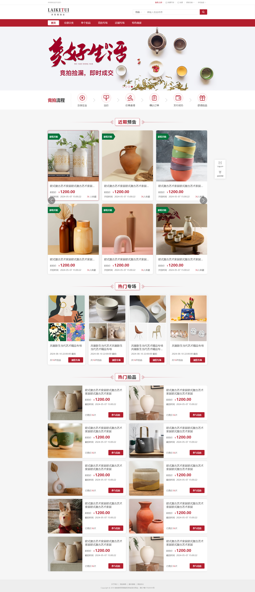
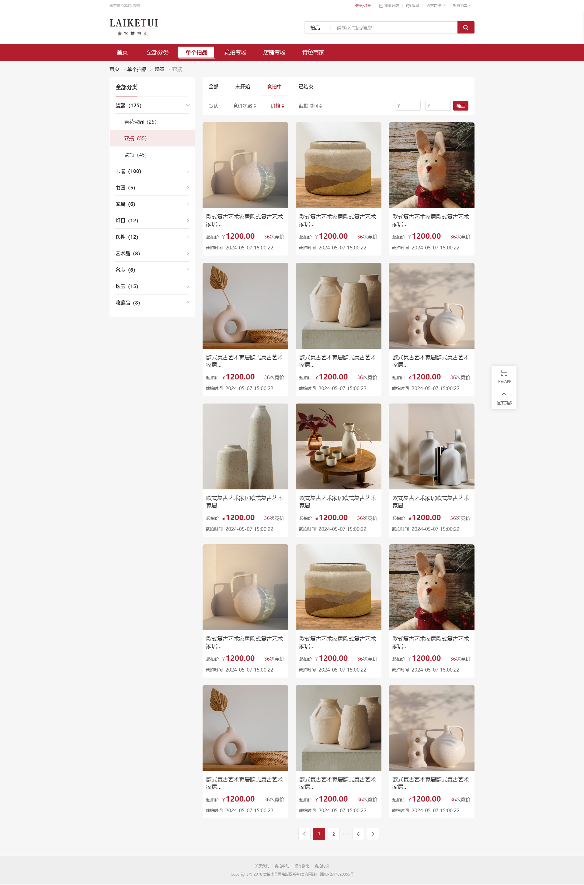
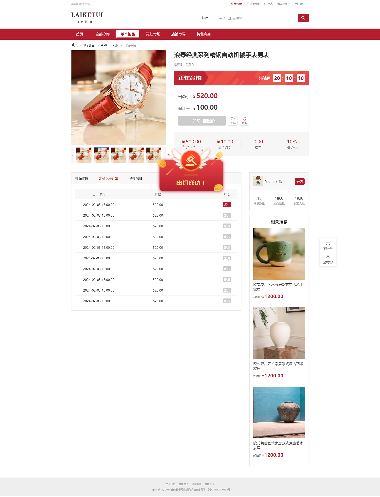
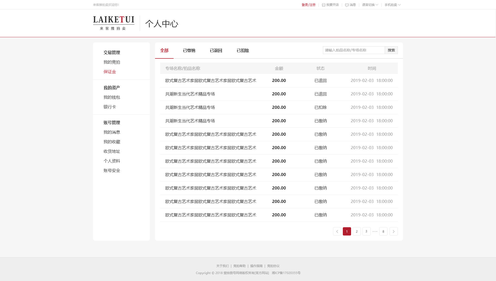

# 来客推拍卖系统解决方案（包含H5、PC、APP、小程序）

来客推拍卖系统是一套完整的在线拍卖电商解决方案，覆盖 H5、PC、APP、小程序四大终端，支持竞拍、专场、店铺等多种交易模式，为用户提供全渠道、一体化的拍卖购物体验。

---

## 商业授权

如需商业授权或技术支持，可通过以下方式联系：

| 方式 | 联系方式 |
|------|----------|
| QQ | 393124780 |
| 电话/微信 | 13237476750 |
| Telegram | [@laiketui](https://t.me/laiketui) |
| WhatsApp | +86 13237476750 |

---

## 项目概述

本项目是来客推电商系统的 PC 端拍卖商城前端，采用服务端渲染（SSR）架构，支持多语言国际化，对接 Java/PHP 后端接口，实现拍卖商品展示、在线出价、保证金管理、订单交易等核心功能。

---

## 演示地址

在线体验：[https://auction.houjiemeishi.com/](https://auction.houjiemeishi.com/)

---

## 核心功能模块

### 1. 拍卖首页

首页作为流量入口，集成丰富的内容展示与导航功能：

- **顶部导航栏**：包含首页、全部分类、单个拍品、竞拍专场、店铺专场、特色商家等入口
- **全局搜索**：支持按拍品名称/专场名称关键词检索
- **品牌 Banner**：大型活动宣传 banner 展示
- **竞拍流程指引**：可视化展示从交纳保证金到获得拍品的完整 6 步流程
- **近期预告**：展示即将开拍的拍品，支持横向滑动浏览
- **热门专场**：聚合多个热门拍卖专场，一键进入浏览
- **热门拍品**：推荐当前最受欢迎的拍卖商品



---

### 2. 拍品列表页

提供结构化的拍品浏览与筛选体验：

- **多级分类导航**：左侧树形分类菜单，涵盖瓷器、青花瓷器、花瓶、瓷瓶、玉器、书画、家具、灯具、摆件、艺术品、名表、珠宝、收藏品等品类
- **状态筛选**：支持按全部、未开始、竞拍中、已结束筛选拍品
- **多维度排序**：支持默认、竞价次数、价格、截拍时间排序
- **价格区间筛选**：可自定义价格范围精准查找
- **拍品卡片**：展示拍品封面图、标题、起拍价、竞价次数、截拍时间等关键信息
- **分页加载**：大数据量场景下分页展示



---

### 3. 拍品详情页

详细的拍品信息与实时竞拍交互中心：

- **商品画廊**：主图 + 缩略图展示，支持图片切换
- **拍品标题与规格**：展示商品名称、规格参数
- **实时竞拍状态**：显示当前竞拍阶段（正在竞拍/即将开始/已结束）
- **倒计时组件**：距截拍结束实时倒计时（时:分:秒）
- **价格信息**：当前价、保证金、起拍价、加价幅度、运费、佣金比例
- **出价操作**：快捷出价按钮，支持收藏与客服咨询
- **出价记录**：展示历史出价明细，标记领先/出局状态
- **详情与规则**：Tab 切换查看拍品详情、竞拍规则
- **商家信息**：展示店铺名称、拍品数量、成交数量、收藏人数
- **相关推荐**：基于当前拍品推荐相似商品



---

### 4. 个人中心 - 保证金管理

用户资产与交易管理后台：

- **左侧功能菜单**：
  - 交易管理：我的竞拍、保证金
  - 我的资产：我的钱包、银行卡
  - 账号管理：我的消息、我的收藏、收货地址、个人资料、账号安全
- **保证金列表**：
  - 状态筛选：全部、已缴纳、已退回、已扣除
  - 搜索功能：按拍品名称/专场名称检索
  - 表格展示：专场名称/拍品名称、金额、状态、时间
  - 分页导航



---

## 技术栈

| 技术 | 版本 | 说明 |
|------|------|------|
| [Nuxt.js](https://nuxtjs.org/) | 2.15.8 | Vue 服务端渲染框架 |
| [Vue.js](https://vuejs.org/) | 2.7.10 | 前端渐进式框架 |
| [Element UI](https://element.eleme.io/) | 2.15.10 | UI 组件库 |
| [Vuex](https://vuex.vuejs.org/) | - | 状态管理 |
| [Vue Router](https://router.vuejs.org/) | - | 路由管理（Nuxt 内置） |
| [Axios](https://axios-http.com/) | 5.13.6 | HTTP 请求库 |
| [Sass](https://sass-lang.com/) | 1.49.9 | CSS 预处理器 |
| [Vue I18n](https://kazupon.github.io/vue-i18n/) | 7.3.1 | 国际化多语言 |

---

## 环境要求

- **Node.js**: 14.20.0（推荐使用 [nvm](https://nvm.uihtm.com/) 管理版本）
- **npm**: 6.x

---

## 项目结构

```
.
├── api/                    # API 请求封装
├── app/                    # 应用配置
├── assets/                 # 样式与静态资源
│   ├── css/               # 页面级样式文件
│   └── mixins/            # 公共混入
├── components/            # 公共 Vue 组件
├── lang/                  # 多语言文件
├── layouts/               # 页面布局模板
├── middleware/            # 路由中间件
├── pages/                 # 页面视图（自动生成路由）
│   ├── auction/          # 拍卖相关页面
│   ├── homeList/         # 商品列表
│   ├── homedetail/       # 商品详情
│   ├── login/            # 登录注册
│   ├── my/               # 个人中心
│   └── ...
├── plugins/               # Nuxt 插件
├── static/                # 静态资源
├── store/                 # Vuex 状态管理
├── env.js                 # 环境变量配置
├── nuxt.config.js         # Nuxt 配置文件
└── package.json           # 项目依赖
```

---

## 安装与运行

### 1. 安装依赖

```bash
npm install
```

### 2. 环境配置

在 `env.js` 中配置对应环境的接口地址：

- `java_dev_production` — Java 开发环境
- `java_prod_production` — Java 生产环境
- `java_test_production` — Java 测试环境
- `php_dev_production` — PHP 本地环境
- `php_prod_production` — PHP 生产环境
- `php_test_production` — PHP 测试环境

### 3. 开发模式

```bash
# Java 环境
npm run java:dev

# PHP 环境
npm run php:dev
```

### 4. 生产打包

```bash
# Java 生产环境打包
npm run java:prod

# Java 测试环境打包
npm run java:test

# PHP 生产环境打包
npm run php:prod

# PHP 测试环境打包
npm run php:test
```

### 5. 生产启动

```bash
# Java 生产环境启动
npm run java:ps

# PHP 生产环境启动
npm run php:ps
```

---

## 部署说明

打包后会生成 `.nuxt` 目录，部署时需要上传以下文件：

| 序号 | 文件/目录 | 说明 |
|------|----------|------|
| 1 | `.nuxt` | 打包产物（每次必传） |
| 2 | `assets` | 静态样式资源（修改后需上传） |
| 3 | `nuxt.config.js` | 配置文件（修改后需上传） |
| 4 | `plugins` | 插件目录（修改后需上传） |
| 5 | `static` | 静态文件（修改后需上传） |
| 6 | `node_modules` | 依赖包（可选，可在服务器安装） |
| 7 | `package-lock.json` | 锁定文件（修改后需上传） |
| 8 | `package.json` | 项目配置（修改后需上传） |
| 9 | `env.js` | 环境变量（每次必传） |

首次部署需安装 PM2 进程管理器：

```bash
npm install pm2 -g
pm2 start npm --name "sh-laike-mall" -- run java:ps
pm2 save
```

非首次部署更新后重启：

```bash
pm2 restart <id>
```

---

## 浏览器支持

- Chrome（推荐）
- Firefox
- Safari
- Edge

---

## 注意事项

1. 确保 Node.js 版本为 **14.20.0**，过高或过低版本可能导致依赖兼容问题
2. 首次部署前务必确认 `env.js` 中的接口地址配置正确
3. 修改 `assets`、`plugins`、`static`、`nuxt.config.js`、`package.json` 后需重新上传对应文件
4. 部署完成后需重启 PM2 进程使更改生效

---

## License

Copyright © 来客推拍卖系统解决方案（包含H5、PC、APP、小程序） 版权所有

---

## 商业授权

如需商业授权或技术支持，可通过以下方式联系：

| 方式 | 联系方式 |
|------|----------|
| QQ | 393124780 |
| 电话/微信 | 13237476750 |
| Telegram | [@laiketui](https://t.me/laiketui) |
| WhatsApp | +86 13237476750 |
